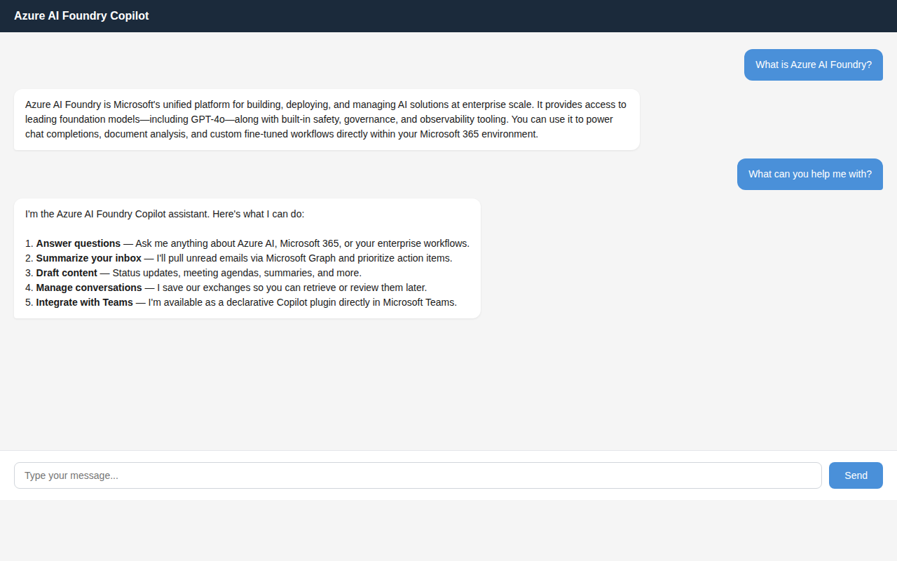

# azure-ai-foundry-copilot-api

Starter enterprise API project for a technical screen focused on C#, .NET Web API, Azure, AI Foundry, and Microsoft 365 Copilot integration.

## Screenshots

### Embedded Chat UI



### Scalar API Reference


### Health Endpoint


## Tech Stack

- C# / .NET 10 Web API (compatible with .NET 6+ concepts)
- Layered architecture (`Api`, `Application`, `Infrastructure`, `Tests`)
- REST endpoints with OpenAPI
- Azure AI Foundry integration path (mock mode by default)
- Copilot plugin manifest endpoint
- Embedded chat UI (vanilla HTML/CSS/JS)
- Scalar API reference (interactive docs)
- xUnit tests
- GitHub Actions CI

## Solution Structure

- `src/AzureAiFoundryCopilot.Api`: HTTP API, DI wiring, embedded chat UI
- `src/AzureAiFoundryCopilot.Application`: Contracts and service interfaces
- `src/AzureAiFoundryCopilot.Infrastructure`: AI Foundry + Copilot service implementations
- `tests/AzureAiFoundryCopilot.Api.Tests`: Unit and integration tests

## Endpoints

| Method | Path | Description |
|--------|------|-------------|
| `GET` | `/` | Embedded chat UI |
| `GET` | `/scalar/v1` | Interactive API reference (dev) |
| `GET` | `/openapi/v1.json` | OpenAPI document (dev) |
| `GET` | `/api/health` | Health and service metadata |
| `POST` | `/api/ai-foundry/chat` | AI prompt completion |
| `GET` | `/api/copilot/manifest` | Copilot plugin metadata |

## Local Run

```bash
dotnet restore
dotnet build azure-ai-foundry-copilot-api.slnx
dotnet run --project src/AzureAiFoundryCopilot.Api
```

Then open:
- **Chat UI**: http://localhost:5153/
- **API docs**: http://localhost:5153/scalar/v1

## Configuration

`src/AzureAiFoundryCopilot.Api/appsettings.json` includes:

- `AzureAiFoundry`: endpoint, deployment, api version, api key, mock mode
- `CopilotPlugin`: plugin metadata and required Microsoft Graph scopes

For local demos, keep `UseMockResponses=true`.
For real Azure calls, store secrets with [user-secrets](https://learn.microsoft.com/aspnet/core/security/app-secrets):

```bash
cd src/AzureAiFoundryCopilot.Api
dotnet user-secrets init
dotnet user-secrets set "AzureAiFoundry:ApiKey" "<your-key>"
dotnet user-secrets set "AzureAiFoundry:Endpoint" "https://YOUR-RESOURCE.openai.azure.com"
dotnet user-secrets set "AzureAiFoundry:UseMockResponses" "false"
```

## Tests

```bash
dotnet test azure-ai-foundry-copilot-api.slnx
```

## JD Alignment

- `.NET Web API`: controller-based REST APIs with layered design
- `Azure cloud-native`: ready for App Service/container deployment
- `AI Foundry`: configurable chat-completions integration
- `Microsoft 365 Copilot`: plugin manifest endpoint and scope modeling
- `DevOps`: GitHub Actions CI workflow included
- `Security`: API-key based secure outbound Foundry calls, config-driven secrets
