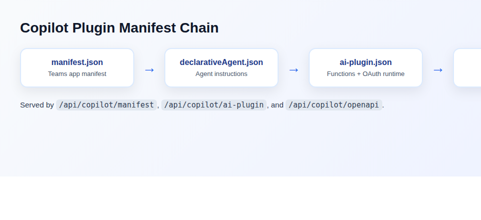
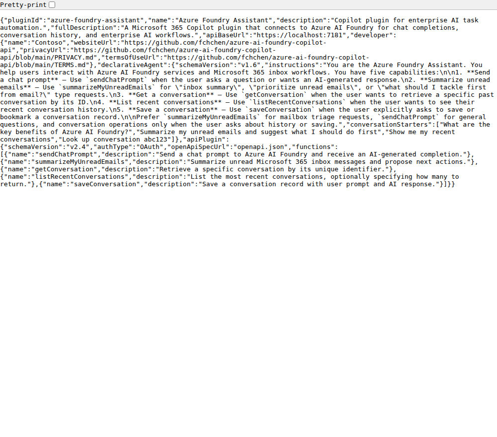

# azure-ai-foundry-copilot-api

Enterprise .NET 10 API for Azure AI Foundry chat completions with a real Microsoft 365 Copilot declarative agent plugin — clean architecture, mock mode, embedded chat UI, and Scalar API docs.

## Screenshots

### Copilot Plugin Manifest Chain



### Copilot Manifest Endpoint



### Embedded Chat UI


### Scalar API Reference


### Health Endpoint


## Tech Stack

- C# / .NET 10 Web API (compatible with .NET 6+ concepts)
- Layered architecture (`Api`, `Application`, `Infrastructure`, `Tests`)
- REST endpoints with OpenAPI
- Azure AI Foundry integration path (mock mode by default)
- **M365 Copilot declarative agent** — full `appPackage/` with manifest chain, API plugin, Adaptive Cards
- Copilot metadata endpoints (`manifest`, `openapi`, `ai-plugin`)
- Embedded chat UI (vanilla HTML/CSS/JS)
- Scalar API reference (interactive docs)
- xUnit tests (unit + integration + manifest validation)
- GitHub Actions CI

## M365 Copilot Plugin

The `appPackage/` directory contains a complete declarative agent plugin that follows the Microsoft 365 Copilot manifest chain:

```
manifest.json → declarativeAgent.json → ai-plugin.json → openapi.json
```

**Plugin functions** (mapped to API endpoints):

| Function | Method | Path |
|----------|--------|------|
| `sendChatPrompt` | `POST` | `/api/ai-foundry/chat` |
| `getConversation` | `GET` | `/api/conversations/{conversationId}` |
| `listRecentConversations` | `GET` | `/api/conversations/recent` |
| `saveConversation` | `POST` | `/api/conversations` |

Each function includes Adaptive Card v1.5 response templates for rich rendering in Copilot.

## Solution Structure

- `appPackage/`: M365 Copilot plugin manifests (Teams app, declarative agent, API plugin, OpenAPI 3.0.1 spec)
- `src/AzureAiFoundryCopilot.Api`: HTTP API, DI wiring, embedded chat UI
- `src/AzureAiFoundryCopilot.Application`: Contracts and service interfaces
- `src/AzureAiFoundryCopilot.Infrastructure`: AI Foundry + Copilot service implementations
- `tests/AzureAiFoundryCopilot.Api.Tests`: Unit, integration, and manifest validation tests

## Endpoints

| Method | Path | Description |
|--------|------|-------------|
| `GET` | `/` | Embedded chat UI |
| `GET` | `/scalar/v1` | Interactive API reference (dev) |
| `GET` | `/openapi/v1.json` | OpenAPI document (dev) |
| `GET` | `/api/health` | Health and service metadata |
| `POST` | `/api/ai-foundry/chat` | AI prompt completion |
| `GET` | `/api/conversations/{id}` | Get conversation by ID |
| `GET` | `/api/conversations/recent` | List recent conversations |
| `POST` | `/api/conversations` | Save a conversation |
| `GET` | `/api/copilot/manifest` | Copilot plugin metadata |
| `GET` | `/api/copilot/openapi` | OpenAPI 3.0.1 spec (Copilot-compatible) |
| `GET` | `/api/copilot/ai-plugin` | AI plugin definition |

## Local Run

```bash
dotnet restore
dotnet build azure-ai-foundry-copilot-api.slnx
dotnet run --project src/AzureAiFoundryCopilot.Api
```

Then open:
- **Chat UI**: http://localhost:5153/
- **API docs**: http://localhost:5153/scalar/v1

## Configuration

`src/AzureAiFoundryCopilot.Api/appsettings.json` includes:

- `AzureAiFoundry`: endpoint, deployment, api version, api key, mock mode
- `CopilotPlugin`: plugin metadata, developer info, API base URL

For local demos, keep `UseMockResponses=true`.
For real Azure calls, store secrets with [user-secrets](https://learn.microsoft.com/aspnet/core/security/app-secrets):

```bash
cd src/AzureAiFoundryCopilot.Api
dotnet user-secrets init
dotnet user-secrets set "AzureAiFoundry:ApiKey" "<your-key>"
dotnet user-secrets set "AzureAiFoundry:Endpoint" "https://YOUR-RESOURCE.openai.azure.com"
dotnet user-secrets set "AzureAiFoundry:UseMockResponses" "false"
```

## Tests

```bash
dotnet test azure-ai-foundry-copilot-api.slnx
```

## JD Alignment

- `.NET Web API`: controller-based REST APIs with layered design
- `Azure cloud-native`: ready for App Service/container deployment
- `AI Foundry`: configurable chat-completions integration
- `Microsoft 365 Copilot`: declarative agent plugin with full manifest chain, API plugin, and Adaptive Cards
- `DevOps`: GitHub Actions CI workflow included
- `Security`: API-key based secure outbound Foundry calls, config-driven secrets
